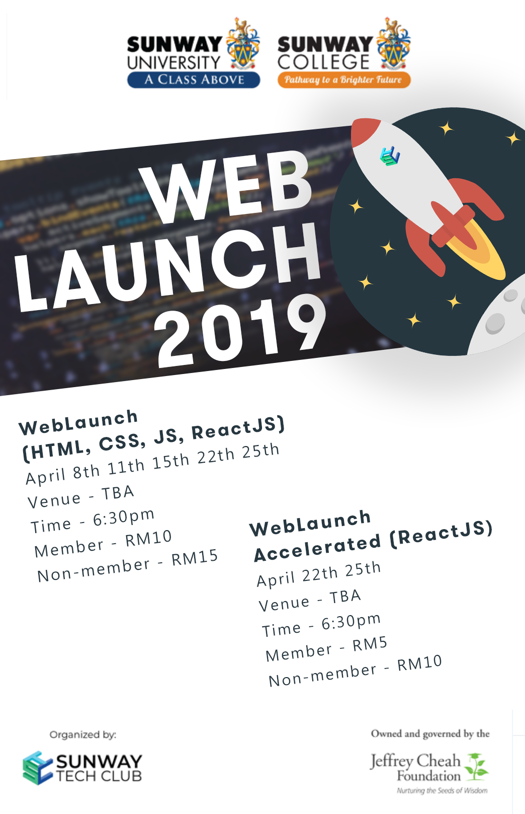

## 2019-WebLaunch

---

WebLaucnh is a web themed workshop on how to build a website. This workshop will cover basic HTML, CSS, Javascript and React JS. For participants who have mastered HTML, CSS and Javascript, Sunway Tech Club offers an accelerated program on React JS only. The date of the workshops are as follow:

April 8th: HTML

April 11th: CSS

April 15th: Javascript

April 22nd & 25th: React JS

{width = 50%}

---

## Workshop Material

[HTML Material](https://docs.google.com/presentation/d/19Ob0wk-xqZn6I9bdPjc0Ey2445Lj0xWw7C9w3mnQAn8/edit?usp=sharing)

---

## Applications Needed

#### Text Editor
[Sublime Text 3](https://www.sublimetext.com/3)

#### Browser
[Chrome](https://www.google.com/chrome/?brand=CHBD&gclid=CjwKCAjw-OHkBRBkEiwAoOZql8HT2-uq1BuT20MO5VKbKr0zJAxhUnhL77vKVXAIerRt2itbhPwSkBoCMZIQAvD_BwE&gclsrc=aw.ds)
OR
[Firefox](https://www.mozilla.org/en-US/firefox/new/)